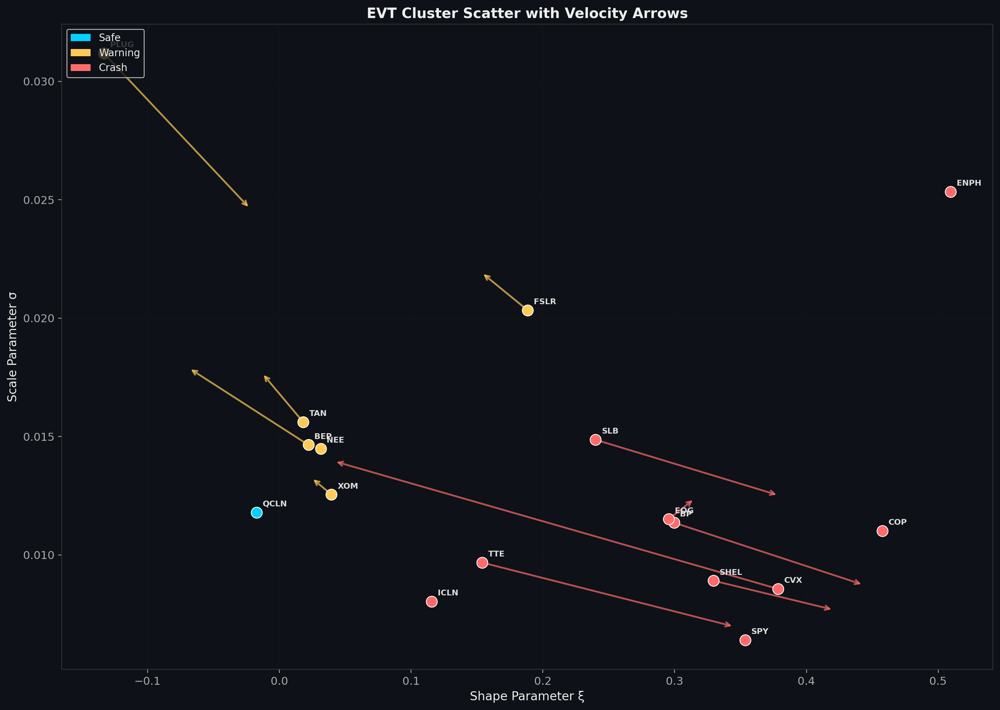
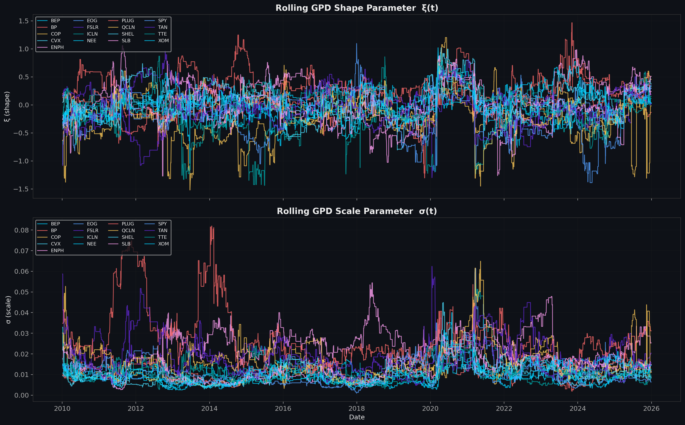
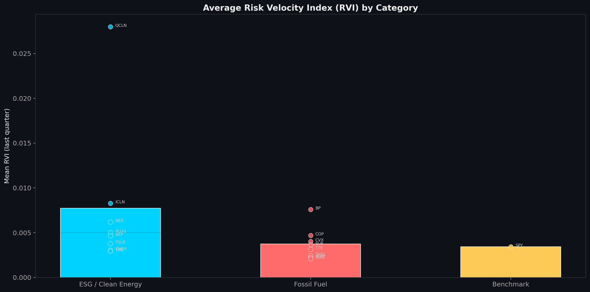
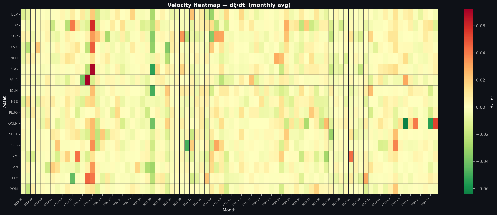
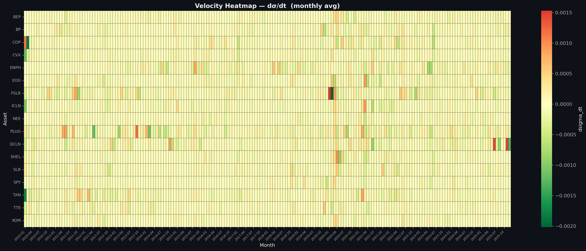
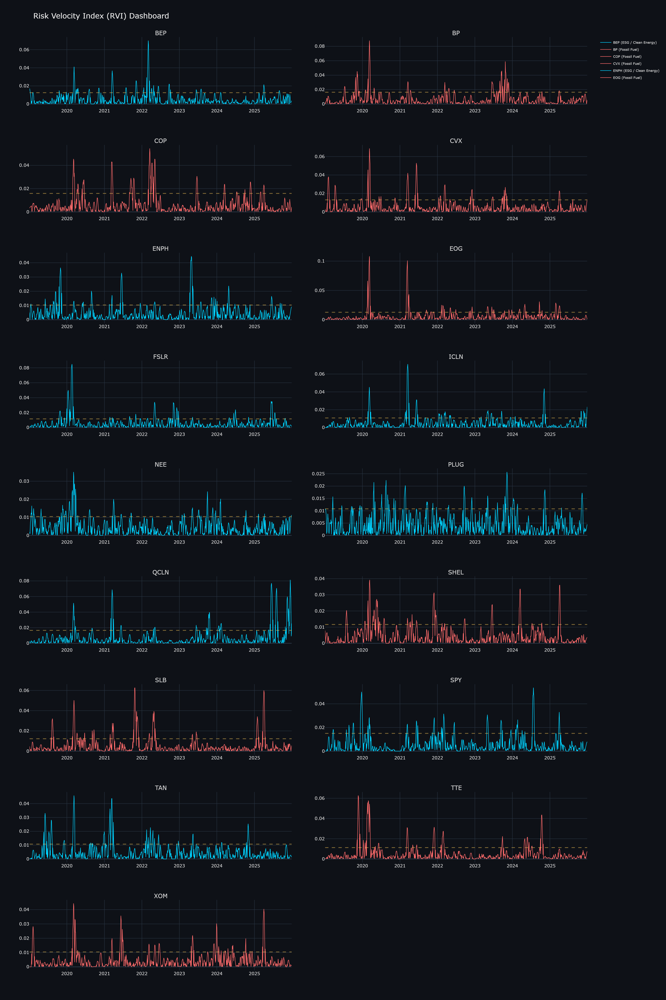

# Implementation and System Architecture

This section outlines the technical implementation of the Temporal EVT-Clustering framework and its translation into an interactive, real-time climate risk monitoring dashboard. The system is engineered using a modular Python architecture, combining rigorous mathematical modeling with a modern, reactive web interface.

## 1. System Pipeline Architecture

The core computational engine operates as a six-stage pipeline designed to process raw financial time-series data into actionable risk intelligence:

1. **Data Acquisition & Preprocessing:** 
   The system fetches historical price data for a predefined basket of assets spanning Fossil Fuel, ESG/Clean Energy, and Benchmark categories. The data is transformed into negative log-returns to isolate tail-risk events.

2. **Rolling Extreme Value Theory (EVT) Modeling:**
   A Peaks-Over-Threshold (POT) approach is applied using a rolling-window mechanism. For each window, the Generalized Pareto Distribution (GPD) parameters—specifically the shape parameter ($\xi$) and scale parameter ($\sigma$)—are estimated using Maximum Likelihood Estimation (MLE) or related optimization techniques.

3. **Temporal Derivative Computation (Risk Velocity):**
   The framework computes the discrete temporal derivatives of the GPD parameters ($d\xi/dt$ and $d\sigma/dt$). These rate-of-change metrics are synthesized into a unified score, establishing the mathematical basis for the **Risk Velocity Index (RVI)**, which quantifies the acceleration of tail risk.

4. **Clustering & Transition Dynamics:**
   Using K-Means clustering in the EVT parameter space (incorporating $\xi$, $\sigma$, and their temporal derivatives), assets are iteratively assigned to three distinct risk regimes: **Safe** (stable tail behavior), **Warning** (elevated and accelerating tail risk), and **Crash** (extreme tail regime with critical velocity). A Markovian transition matrix is derived from the rolling cluster labels to probabilistically model asset migration between these states. Furthermore, a **Risk Velocity Alert** mechanism flags assets transitioning into the Warning state by detecting acute spikes in their RVI that breach dynamically calculated critical thresholds.

5. **Validation & Benchmarking Engine:**
   To ensure empirical robustness, the framework incorporates a dedicated validation module. **Silhouette Score** analysis is performed to quantify the separability and cohesion of the derived risk clusters (Safe, Warning, Crash), providing a measure of clustering quality. Additionally, **Lead Time ($\Delta T$)** is computed—defined as the temporal gap between the first RVI-triggered Warning alert and the subsequent realization of a Crash-state event—to empirically validate the framework's predictive capability as an early-warning system.

6. **Data Export & Persistence:**
   The output matrices, transition probabilities, validation metrics, and asset trajectories are serialized into structurally uniform CSV datasets, serving as the static backend for the visualization layer.

## 2. Interactive Dashboard Engineering

To democratize the theoretical framework and provide real-time analytical capabilities, a production-grade web dashboard was developed using **Streamlit**. The front-end departs from conventional academic layouts by implementing a high-fidelity, polished UI (utilizing custom CSS injections) designed to mimic institutional analytics terminals.

### Core Dashboard Components:
*   **Executive Summary:** A high-level ecosystem overview presenting system-wide averages and an integrated Risk Velocity Alert panel highlighting assets entering the Warning state. It employs institutional-grade analytical widgets and dynamic Plotly donut charts to visualize current cluster composition across Safe, Warning, and Crash regimes.
*   **Risk Velocity Heatmap:** Leverages Plotly's interactive heatmap capabilities (`px.imshow`) to display the temporal evolution of shape/scale velocities and the RVI across all tracked assets, applying divergent color scales for immediate visual anomaly detection. Options accurately display formulaic structures like $d\xi/dt$ and $d\sigma/dt$.
*   **Asset Deep Dive:** Permits granular interrogation of individual assets. It renders synchronised, filled time-series plots (GPD parameter evolution alongside velocity derivatives), overlaid with statistical benchmarks (e.g., 90th percentile thresholds).
*   **Cluster Analysis (Markov Dynamics):** Integrates automated Sankey diagrams to map the probability flows of assets transitioning between risk states, directly translating the computationally derived Markov transition matrix into an intuitive flow representation.
*   **Reactive Filtering & Status Monitoring:** A custom-styled, permanently expanded sidebar operates as the global control center. It reflects live data ingestion statuses, handles routing without page reloads, and enforces strict asset categorization taxonomies. 

## 3. Technology Stack

*   **Core Logic:** Python 3.x
*   **Data Manipulation & Math:** NumPy, Pandas, SciPy
*   **Machine Learning/Clustering:** Scikit-Learn
*   **Front-End Framework:** Streamlit (with extended HTML/CSS overrides)
*   **Interactive Visualization:** Plotly Graph Objects & Plotly Express

---

## 4. Visual Supplements (Appendix)

The following high-resolution charts are automatically generated by the pipeline and power the dashboard's analytics.

### Cluster Scatter with Velocity

### Rolling EVT Parameters over Time

### Average RVI Profile by Sector

### Heatmaps: Shape and Scale Velocities

### RVI Dashboard Output

